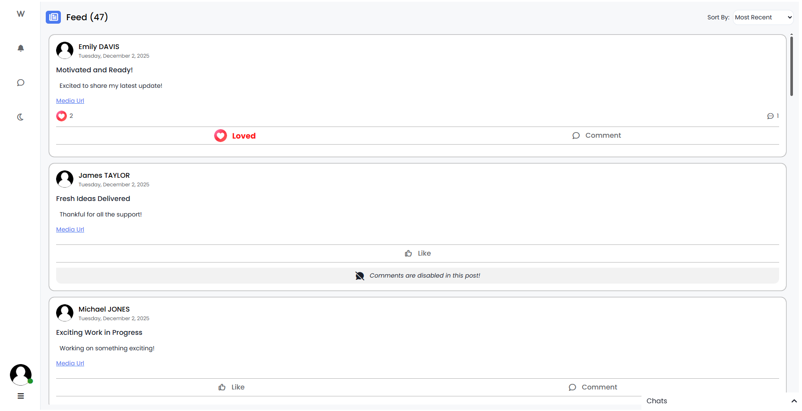
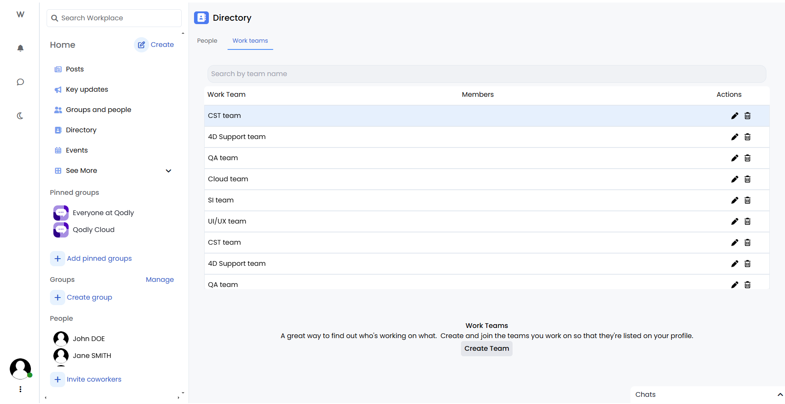
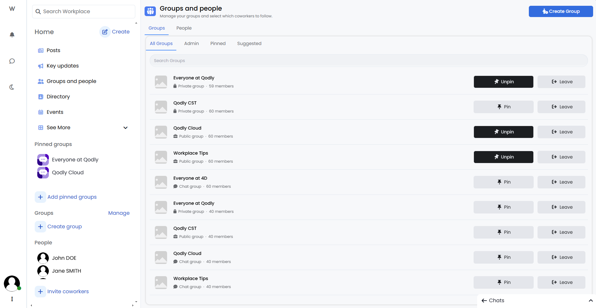
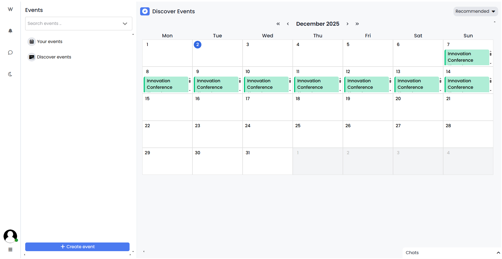
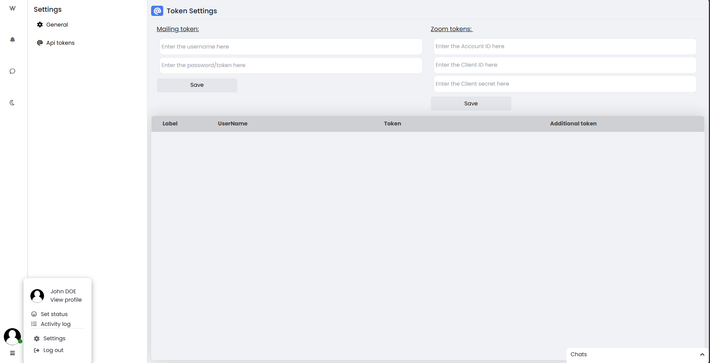

# 🏢 Workplace Application

This demo app is built with **4D Qodly Pro** and is designed to serve as a modern internal social network and collaboration platform.

## Purpose of the application

The **Workplace Application** consolidates internal company communication into one organized platform.  
It helps teams stay connected, informed, and engaged without relying on scattered tools.

The application aims to:

- Enhance communication between employees and teams
- Centralize announcements and internal updates
- Provide a unified social activity feed
- Encourage collaboration and company culture
- Offer secure profiles, groups, posts, and messaging

---

## Main Features

- **Activity Feed**: Company-wide posts, announcements, likes, and comments.

  

- **Employee Profiles**: Structured employee directory with personal and professional details.

  

- **Groups & Teams**: Public and private collaboration spaces with dedicated feeds.

  

- **Messaging & Conversations**: One-to-one and group chats with real-time interaction.

  

- **Events & Calendar**: Internal events, meetings, and RSVP tracking.

  

- **Settings & Credentials**: Centralized configuration and access control.

  

---

## How to Run

### Pre-requisites (4D Software)

- Download the latest Release version of 4D: [Product Download](https://us.4d.com/product-download/Feature-Release)
- Or the latest Beta version: [Beta Program](https://discuss.4d.com/)
- Follow activation steps: [Installation Guide](https://developer.4d.com/docs/GettingStarted/installation)

### Steps to Run the Project

- Clone or download this repository to your local machine.
- Open the project in 4D: **File > Open Project**
- Open **Qodly Studio**: **Design > Qodly Studio**
- Click **Run** to start the server and preview the app in your browser.

---

## Configuration & Credentials

### Do I need to create external accounts?

- **Mailing & Meetings (optional)**: Required only if you want email notifications or external meeting integrations.
  - Sendgrid api services can be used for mailing.
  - Collaboration services (e.g., Zooms meetings) require their respective credentials.

### Where does the app read credentials?

- Credentials are configured via the **Settings** page inside the application.
- External service keys and secrets are stored and accessed through the database.

## Test Accounts and Sample Data

- Sample data can be generated via the UI or dedicated data generation method .

---

## Where to Find the Code for Each Feature

- **Generating data**

  - Server: `FakeData.4dm` — Generated random data for the application's dataclasses.
  - UI: `home.WebForm`

- **Authentication & Profiles**
  - Server: `User.4dm`, `UserEntity.4dm`
  - UI: `Login.WebForm`, `Profile.WebForm`

- **Custom UI components** used to enhance user experience, including:

  - Virtualizer (in the postsFeed page and other pages)

  - Calendar (in the userEvents and discoverEvents pages)

  - Avatar group (in the workTeamsList page and other pages)

  - Popover (in the index page and other pages)

  - Map and stepper (in the newEvent page)

  - Slate editor (in the newNote page and other pages)

  - Date picker (in the updateIncident page and other pages)

  - Query builder (in the usersList page)

  - Accordion (in the index page)

This structure allows you to easily customize, extend, or reuse **Workplace** as a foundation for your internal communication and collaboration solutions.
